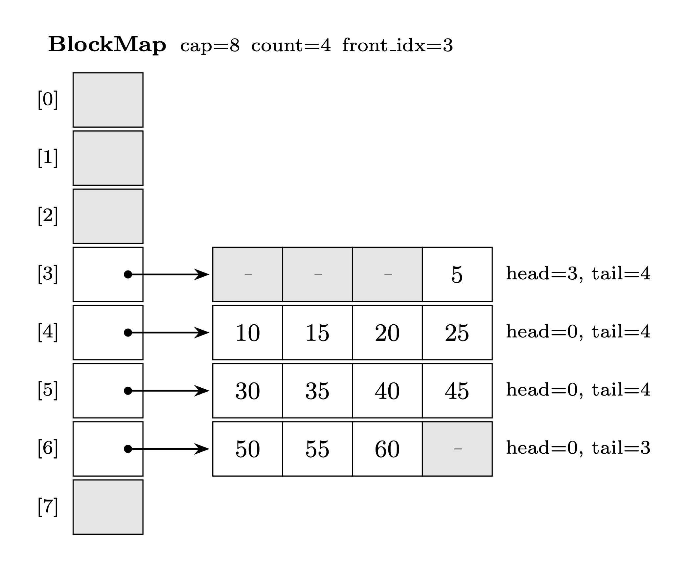

# Homework Assignment 4

## Overview

This assignment has two independent parts. **Part 1** is a focused warm-up on C++ pointer mechanics and the Rule of Three. **Part 2** asks you to implement a deque backed by a segmented array. Both parts reinforce the same core skill: writing correct C++ code that manages heap memory by hand.

> [!CAUTION]
> **Disable ALL AI autocomplete in your editor before you start.**
> In VS Code this means turning off GitHub Copilot and any other extension
> that suggests or completes code.
> You may use LLMs to ask about syntax or to get an
> explanation of a concept, e.g., *what does `delete[]` do?* or *what is a segmented array?*
> Submitting AI-generated code without understanding it defeats the entire purpose
> of this assignment.

> [!IMPORTANT]
> Read every specification and all provided code carefully before writing a single line. The comments in the skeleton files are your primary guide.

## Part 1: Pointer refresher

**File to complete:** `part1/pointers.cpp`

The class declaration and standalone function signatures are in `pointers.h` (provided — do not modify). The autograder is in `test_pointers.cpp` (provided — do not modify). **Your job is to fill in every `TODO` in `pointers.cpp`**.

### What you will practice

| Section | Topic |
|---------|-------|
| 1 | Declaring pointers, address-of (`&`), dereference (`*`), pointer arithmetic |
| 2 | Allocating and freeing a jagged 2D array (`int**`) |
| 3 | Implementing the **Rule of Three** for a resource-owning class |

### Pointer basics

A pointer stores a memory address. The address-of operator `&x` gives you the address of `x`. The dereference operator `*p` reads (or writes) the value at the address `p`.

An array's name decays to a pointer to its first element. Adding an integer to a pointer advances it by that many elements (not bytes):

```cpp
int arr[5] = {10, 20, 30, 40, 50};
int* q = arr;   // q points to arr[0]
// *q     == 10  (arr[0])
// *(q+1) == 20  (arr[1])
// ++q advances q to point at arr[1]
```

### Jagged 2D array

The structure below is called a **jagged array** because each row has a different length. The outer array is `int** grid`, and each `grid[i]` is an `int*` pointing to a row.

```text
grid[0] --> [ 0, 1, 2 ]             
grid[1] --> [ 0, 1, 2, 3, 4 ]   
grid[2] --> [ 0, 1 ]                  
```

In the provided code, you will work with this structure: allocating memory on the heap and tearing it down cleanly.
**Allocation order**: outer array first, then each row.
**Deallocation order**: each row first, then the outer array.

> [!WARNING]
> Reversing the deallocation order destroys the row pointers before you can use them  -  a common bug. Always free inner arrays before the outer array.

### The Rule of Three

In the provided code, the class `IntArray` allocates a `int*` array on the heap and stores it as a member pointer. This makes it a **resource-owning class**. The class is responsible for allocating and releasing heap memory whose lifetime is tied to the object.

The C++ compiler automatically generates default versions of the copy constructor and copy assignment operator for every class. For plain data types (no pointers, no heap), the defaults work fine. For resource-owning classes, they are **wrong**.

The default copy does a **shallow copy**, i.e., it copies the pointer value, not the data it points to. Two objects then point at the same heap array:

```cpp
IntArray a(3);    // a.data -> [0, 0, 0]  (heap)
IntArray b = a;   // default copy: b.data -> same address!
b.at(0) = 99;     // also changes a.at(0)
// When a and b go out of scope, delete[] runs TWICE on the same address -> crash
```

The **Rule of Three** states that if your class needs to define any one of the following, it almost certainly needs all three. The table below summarizes the responsibilities of each within the context of the `IntArray` class:

| Function | Responsibility |
|----------|---------------|
| Destructor | Release the heap array (`delete[] data`) |
| Copy constructor | Allocate a fresh array and copy every element (**deep copy**) |
| Copy assignment operator | Free the old array, then deep-copy from the source |

> [!WARNING]
> **Do not shallow-copy the pointer.** If two objects share `data`, both destructors will `delete[]` the same address  -  undefined behavior and a likely crash.

> [!WARNING]
> The copy assignment operator **must** guard against self-assignment (`if (this == &other) return *this;`) before freeing `data`. Without the guard, `a = a` deletes the source before copying from it.

### Compile and run

```bash
# move into the part1 directory, then compile and run
$ g++ -std=c++11 -Wall -Werror pointers.cpp test_pointers.cpp -o test_pointers
$ ./test_pointers
```

## Part 2: Deque via Segmented Array

### What is a segmented-array deque?

A **segmented array** stores deque elements across multiple fixed-size **blocks** instead of one contiguous buffer. A central **BlockMap** holds an ordered list of pointers to those blocks.

This gives you O(1) push and pop at both ends: only the front or back block is ever touched. When the BlockMap itself is full, only its pointer array is reallocated — block data is never copied.

### Structure

The diagram below uses `BLOCK_SIZE = 4` and holds values 5 through 60 (front to back).

<p align="center">
  
</p>

Each block tracks a **live window** `[head, tail)` inside its fixed array:
- `head > 0` — room to `push_front` without allocating a new block
- `tail < BLOCK_SIZE` — room to `push_back` without allocating a new block

The BlockMap is itself a **circular array** of block pointers. Two distinct index spaces apply:

- **Logical index** i — a block's position in deque order (0 = front block, `size()-1` = back block). This is what callers use.
- **Physical index** — a block's actual slot in the underlying array. Because the array is circular, logical index 0 can sit at any physical position.

Translating between them is the central challenge of the BlockMap implementation. Prepending a block requires no data movement — only the bookkeeping that tracks which physical slot is the logical front.

### Push and pop behavior

**`push_back(val)`** — write into the back block. If the back block is full (or the deque is empty), append a new `Block(0, 0)` to the BlockMap first.

**`push_front(val)`** — write into the front block. If the front block is full (or the deque is empty), prepend a new `Block(BLOCK_SIZE, BLOCK_SIZE)` first. Starting with `head = tail = BLOCK_SIZE` gives an empty live window with room at the front.

**`pop_back()`** — remove the last element of the back block. If the back block becomes empty afterwards, remove it from the BlockMap.

**`pop_front()`** — mirror of `pop_back()`.

Block boundary example:

```
Block at index i:
                  head=3  tail=4  [ , , , 5 ]
push_front(3):    head=2  tail=4  [ , , 3, 5 ]
push_front(1):    head=1  tail=4  [ , 1, 3, 5 ]
push_front(-1):   head=0  tail=4  [-1, 1, 3, 5 ] # front block now full
push_front(7):    prepend new Block(BLOCK_SIZE, BLOCK_SIZE) to BlockMap
                
New block at index i-1 mod capacity:
                  head=3  tail=4  [ , , , 7 ]
```

### Classes to implement

#### Class Block: `part2/block.cpp`

A fixed-size array with a live window `[head, tail)`. `data[]` is a plain array inside the object — no heap allocation, no destructor needed.

**Invariant:** `0 <= head <= tail <= BLOCK_SIZE`

| Signature | Description |
|-----------|-------------|
| `Block()` | Creates an empty block ready to receive `push_back` calls. |
| `Block(size_t h, size_t t)` | Creates a block with explicit head and tail. Use `Block(BLOCK_SIZE, BLOCK_SIZE)` to create a block ready for `push_front`. |
| `size_t size() const` | Returns the number of elements currently in the live window. |
| `bool empty() const` | Returns true if the live window holds no elements. |
| `bool can_push_back() const` | Returns true if there is room to push at the back of the live window. |
| `bool can_push_front() const` | Returns true if there is room to push at the front of the live window. |
| `void push_back(int val)` | Writes `val` into the back of the live window and expands it to the right. Requires `can_push_back()`. |
| `void push_front(int val)` | Writes `val` into the front of the live window and expands it to the left. Requires `can_push_front()`. |
| `void pop_back()` | Shrinks the live window by one from the right. Requires `!empty()`. |
| `void pop_front()` | Shrinks the live window by one from the left. Requires `!empty()`. |
| `int& at(size_t i)` / `const int& at(size_t i) const` | Returns a reference to the i-th element in the live window (0 = front). Throws `std::out_of_range` if `i` is out of bounds. |
| `const int& front() const` | Returns a reference to the first element in the live window. Requires `!empty()`. |
| `const int& back() const` | Returns a reference to the last element in the live window. Requires `!empty()`. |

```bash
# move into the part2 directory, then compile and run
$ g++ -std=c++11 -Wall -Werror block.cpp test_block.cpp -o test_block
$ ./test_block
```

#### Class BlockMap: `part2/blockmap.cpp`

A circular array of `Block*` pointers. BlockMap **owns** every block it holds: `push_*_block` transfers ownership in, `pop_*_block` deletes the removed block, and `~BlockMap` deletes everything on destruction.

| Signature | Description |
|-----------|-------------|
| `BlockMap(size_t initial_capacity = 8)` | Creates an empty BlockMap with the given initial capacity. |
| `~BlockMap()` | Frees every owned Block, then releases the internal slots array. |
| `size_t size() const` | Returns the number of active blocks. |
| `bool empty() const` | Returns true if no blocks are active. |
| `bool full() const` | Returns true if there is no room to add another block without resizing first. |
| `Block* front_block() const` | Returns a pointer to the front Block. Requires `!empty()`. |
| `Block* back_block() const` | Returns a pointer to the back Block. Requires `!empty()`. |
| `Block* get_block(size_t i) const` | Returns a pointer to the Block at logical position i (0 = front). Requires `i < size()`. |
| `void push_front_block(Block* b)` | Inserts `b` at the logical front; BlockMap takes ownership. Resizes automatically if full. |
| `void push_back_block(Block* b)` | Appends `b` at the logical back; BlockMap takes ownership. Resizes automatically if full. |
| `void pop_front_block()` | Removes and **deletes** the front Block. Requires `!empty()`. |
| `void pop_back_block()` | Removes and **deletes** the back Block. Requires `!empty()`. |
| `size_t back_idx() const` *(private)* | Returns the physical array index of the back block. Requires `size() > 0`. |
| `void resize()` *(private)* | Doubles the capacity of the slots array, preserving logical block order. |

```bash
# move into the part2 directory, then compile and run
$ g++ -std=c++11 -Wall -Werror block.cpp blockmap.cpp test_blockmap.cpp -o test_blockmap
$ ./test_blockmap
```

#### Class Deque: `part2/deque.cpp`

A deque backed by a `BlockMap`. The Deque never calls `new` or `delete` directly — all block memory is managed by the BlockMap.

| Signature | Description |
|-----------|-------------|
| `Deque()` | Creates an empty deque with no blocks allocated. |
| `size_t size() const` | Returns the total number of elements in the deque. |
| `bool empty() const` | Returns true if the deque holds no elements. |
| `void push_back(int val)` | Appends `val` to the back of the deque, allocating a new Block when needed. |
| `void push_front(int val)` | Prepends `val` to the front of the deque, allocating a new Block when needed. |
| `void pop_back()` | Removes the back element. Throws `std::out_of_range` if empty. |
| `void pop_front()` | Removes the front element. Throws `std::out_of_range` if empty. |
| `const int& back() const` | Returns a reference to the back element without removing it. Throws `std::out_of_range` if empty. |
| `const int& front() const` | Returns a reference to the front element without removing it. Throws `std::out_of_range` if empty. |

> [!NOTE]
> The `Deque` destructor does **not** need to be written. When a `Deque` goes out of scope, `~BlockMap()` runs automatically on the `bmap` member and frees every Block and the slots array.

```bash
# move into the part2 directory, then compile and run
$ g++ -std=c++11 -Wall -Werror block.cpp blockmap.cpp deque.cpp test_deque.cpp -o test_deque
$ ./test_deque
```

## Submission and Grading

> [!IMPORTANT]
> **This assignment grades understanding, not just correct output.** Submitting working code is necessary but not sufficient. The in-class quiz that follows is an integral part of your grade and directly tests whether you can explain, trace, and reason about your own implementation.

### Grading

The autograder awards up to **111 points** by compiling your submitted files against the unmodified provided headers and test files and running each test in isolation. A test earns full points if it compiles, runs without crashing, and passes every check; it earns zero otherwise.

| Component | Points |
|-----------|-------:|
| Part 1 - Section 1: Pointer Basics | 5 |
| Part 1 - Section 2: Jagged Arrays | 10 |
| Part 1 - Section 3: Rule of Three | 15 |
| Part 2 - Block | 20 |
| Part 2 - BlockMap | 22 |
| Part 2 - Deque | 39 |
| **Total** | **111** |

The **in-class quiz** is held during lab on **Thursday, June 25** and is closed-book. Questions will ask you to trace execution, explain design decisions, and predict behavior of your own implementation. It is scored out of 100.

The two are combined as follows:

```
code  = min(score, 100)  # max is 111, capped at 100
if quiz >= 70:
    grade = code
else:
    grade = code * quiz / 70
```

**Rationale:** A quiz score >= 70 demonstrates that you understand your implementation -
your code grade stands unchanged. Below 70, the penalty scales proportionally: the less
you can explain your work, the less credit it earns. The 11-point buffer (111 pts
possible, capped at 100) means a student can miss a few tests and still reach
code = 100 before the quiz is applied.

### Submission

This assignment relies on automated evaluation. Once you are finished, you **must**
submit the files listed below via [Gradescope](https://www.gradescope.com/) to record
your grade. Use the exact filenames provided here:

- `pointers.cpp`
- `block.cpp`
- `blockmap.cpp`
- `deque.cpp`
- `llm-usage.txt`

Do **not** modify the provided files (`pointers.h`, `block.h`, `blockmap.h`, `deque.h`, or any `test_*.cpp`). Your implementations must compile cleanly and pass all provided tests without changing those files. Any deviation from the exact filenames above will cause autograding to fail, resulting in no credit.

The `llm-usage.txt` file must contain the name of any LLM you used, a copy of the
prompts you entered, and the responses you received. If you did not use an LLM, simply
write "No LLM used". Recall that LLMs may only be used for syntax questions and concept
explanations, not to generate or fix code.

> [!CAUTION]
> Academic integrity is of utmost importance. Any attempt at cheating or plagiarism will
> result in forfeiture of credit. Further actions may include failing the course or
> referral for disciplinary measures.
