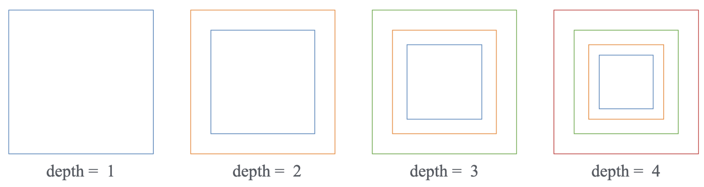
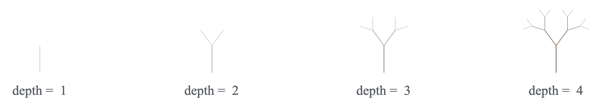
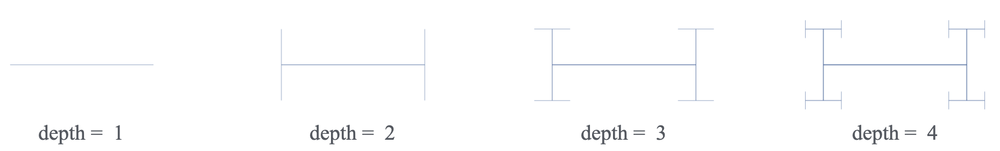
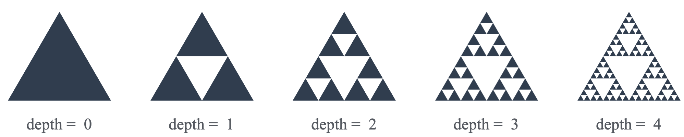

# Lab 04 - Recursion

## Overview

In this lab you will explore **recursion** through visual output. Your programs will write **SVG files**, structured text that a browser or image viewers render as graphics. Each
program reads its parameters from the command line using `argc` and `argv`, generates SVG markup, and prints it to standard
output. Redirecting that output to a `.svg` file gives you a drawing you can open instantly in any
file manager.

The lab has four parts:

- **Part 1** - Learn what SVG is, study a minimal SVG by hand, and build a C++ program that outputs
  SVG to standard output.
- **Part 2** - Implement *linear* recursion to draw nested squares. Command-line arguments are
  introduced here.
- **Part 3** - Implement *binary* recursion to draw two different fractal patterns, selected by a
  type argument.
- **Part 4** - Implement *multiple* recursion to draw a fractal pattern.

> [!CAUTION]
> For this lab, **AVOID** using LLMs to **generate code or solutions** for the exercises. In
> particular, we ask you to explicitly **DISABLE** Copilot or similar tools in your IDE.
> You may ask specific questions to LLMs about concepts or language syntax, but we
> strongly discourage using LLMs to write code for you.

> [!IMPORTANT]
> Read all provided code and specifications carefully before writing a single line. Recursion is only
> correct when **both** the base case and the recursive case are right. Trace the first two or three
> depth levels on paper before touching the keyboard. Discuss the logic with your group and ask the instructor or TA if you have any questions.

## Part 1: SVG Basics

### What is SVG?

SVG stands for **Scalable Vector Graphics**. It is a plain-text file format, like HTML, that describes shapes using XML tags. A browser or file manager can render it immediately; no extra
software or graphics library is required.

A few properties that make SVG useful for this lab:

- It is just text, so your C++ program produces it with `std::cout`.
- It is resolution-independent: the image looks sharp at any zoom level.
- Every modern operating system can open `.svg` files directly by double-clicking them.

The SVG coordinate system places the **origin (0, 0) at the top-left corner**. The x-axis grows to
the right and the y-axis grows **downward**. This differs from the standard mathematical convention
and matters whenever you translate angles or vectors into SVG coordinates.

### A Minimal SVG

Save the text below into a file called `square.svg` and open it by double-clicking it in your file
manager.

```xml
<?xml version="1.0" encoding="UTF-8"?>
<svg xmlns="http://www.w3.org/2000/svg" width="500" height="500">
  <rect x="100" y="100" width="300" height="300" fill="none" stroke="black" stroke-width="2"/>
</svg>
```

The tags and attributes worth knowing for this lab:

| Tag / Attribute | Meaning |
|-----------------|---------|
| `<svg width="W" height="H">` | Canvas of W x H pixels; must close with `</svg>` |
| `<rect x="X" y="Y" width="W" height="H"/>` | Rectangle; (X, Y) is the **top-left** corner |
| `<line x1="X1" y1="Y1" x2="X2" y2="Y2"/>` | Straight line from (X1,Y1) to (X2,Y2) |
| `<polygon points="x1,y1 x2,y2 x3,y3"/>` | Filled polygon with the listed vertices |
| `fill="none"` | Transparent interior |
| `stroke="black"` | Border (or line) color |
| `stroke-width="2"` | Border thickness in pixels |

### Rendering SVG from C++

The program below produces the same square by printing SVG markup to standard output.

```cpp
#include <iostream>

int main() {
    std::cout << "<?xml version=\"1.0\" encoding=\"UTF-8\"?>\n";
    std::cout << "<svg xmlns=\"http://www.w3.org/2000/svg\""
              << " width=\"500\" height=\"500\">\n";
    std::cout << "  <rect x=\"100\" y=\"100\" width=\"300\" height=\"300\""
              << " fill=\"none\" stroke=\"black\" stroke-width=\"2\"/>\n";
    std::cout << "</svg>\n";
    return 0;
}
```

Compile it, run it, and **redirect** the text output to a `.svg` file using the `>` operator in the shell:

```bash
$ g++ -std=c++11 main.cpp -o main
$ ./main > square.svg
```

Double-click `square.svg` in your file manager. Your browser opens it and shows a black square on a
white background. **Every program you write in this lab follows this exact pattern**: generate SVG
text, redirect to a file, open in browser.

> [!NOTE]
> Your only output mechanism is `std::cout`. Do not open files, do not use any graphics library.
> The browser handles all rendering.

## Part 2: Linear Recursion

### Concept

**Linear recursion** means a function calls itself exactly **once** in its recursive case. Each call
does a fixed amount of work and then delegates one smaller sub-problem to itself. The call stack grows
linearly with the depth.

The **depth** parameter controls how many levels of recursion occur:

- `depth == 0` is the **base case**, the function does nothing and returns immediately.
- `depth == k` means "do this level's work", then call yourself with `depth == k - 1`.

Think of depth as the number of "layers" still remaining to draw. At depth 1 you get one layer. At
depth 6 you get six layers stacked on top of each other.

### Pattern: Nested Squares

Your program draws **nested squares**: a large outer square, a smaller square inside it sharing the
same center, a smaller square inside that one, and so on. Each square is scaled down by a fixed
factor relative to the one surrounding it.

<p align="center">
  
</p>

At depth 1 you see one square. At depth N you see N concentric squares, all sharing the same center.
A scale factor of about 0.72 between consecutive squares works well; experiment freely.

### Command-Line Arguments

All three programs in this lab read their parameters from the **command line**. C++ exposes
command-line arguments through the `argc` and `argv` parameters of `main`:

```cpp
int main(int argc, char* argv[]) {
    // argc     : total number of tokens, including the program name itself.
    // argv[0]  : the program name as a C-string.
    // argv[1]  : the first user-supplied argument (a C-string).
    // argv[2]  : the second user-supplied argument, if present.
    // ...
}
```

To convert a string argument to an integer, use `std::atoi` from `<cstdlib>`:

```cpp
int depth = std::atoi(argv[1]);
```

Always verify that the user supplied the correct number of arguments **before** accessing `argv[1]`
or beyond. Reading out-of-bounds entries is undefined behavior.

Run the linear program like this:

```bash
$ ./linear 6 > linear.svg
```

The `6` becomes `argv[1]`. The shell redirects all standard output into `linear.svg`.

### Your Task

Implement `linear.cpp`. It must:

1. Read exactly one command-line argument: `depth` (a non-negative integer).
2. Print a valid SVG to standard output containing `depth` nested, centered squares.
3. Print an error message to `std::cerr` and exit if the wrong number of arguments is supplied.

### Skeleton

```cpp
#include <iostream>
#include <cstdlib>

const int WIDTH  = 500;
const int HEIGHT = 500;

void svgOpen() {
    std::cout << "<?xml version=\"1.0\" encoding=\"UTF-8\"?>\n";
    std::cout << "<svg xmlns=\"http://www.w3.org/2000/svg\""
              << " width=\""  << WIDTH
              << "\" height=\"" << HEIGHT << "\">\n";
    std::cout << "  <rect width=\"100%\" height=\"100%\" fill=\"white\"/>\n";
}

void svgClose() {
    std::cout << "</svg>\n";
}

// Emits a <rect> tag for a square centered at (cx, cy) with the given side length.
void drawRect(double cx, double cy, double size) {
    double x = cx - size / 2.0;
    double y = cy - size / 2.0;
    std::cout << "  <rect"
              << " x=\""      << x    << "\" y=\""      << y
              << "\" width=\"" << size << "\" height=\"" << size
              << "\" fill=\"none\" stroke=\"black\" stroke-width=\"1.5\"/>\n";
}

// TODO: implement the recursive function.
//
// Hints:
//   - What is the base case?  What should happen when depth == 0?
//   - Call drawRect for the current square, then recurse.
//   - What fraction of 'size' should the next square use?
//   - The center (cx, cy) does not change between calls here.
void drawSquares(double cx, double cy, double size, int depth) {
    // YOUR CODE HERE
}

int main(int argc, char* argv[]) {
    if (argc != 2) {
        std::cerr << "Usage: " << argv[0] << " <depth>\n";
        return 1;
    }
    int depth = std::atoi(argv[1]);

    svgOpen();
    drawSquares(WIDTH / 2.0, HEIGHT / 2.0, WIDTH * 0.90, depth);
    svgClose();
    return 0;
}
```

Compile and run:

```bash
$ g++ -std=c++11 -Wall -Werror linear.cpp -o linear
$ ./linear 6 > linear.svg
```

> [!NOTE]
> Try different scale factors (0.5, 0.65, 0.80) and observe how the spacing between squares changes.
> You can also pass a different `stroke` color based on the current depth level to produce a
> multi-colored result.

> [!WARNING]
> A missing or incorrect base case will cause infinite recursion and a stack overflow crash. Always
> trace `depth == 0` and `depth == 1` by hand before compiling.

## Part 3: Binary Recursion

### Concept

**Binary recursion** means a function calls itself **exactly twice** in its recursive case. The number
of active calls at any given depth doubles at each level, so the drawing becomes significantly more
detailed with every step. Both recursive calls work on independent sub-problems derived from the
current state.

The **depth** parameter works exactly as before: `depth == 0` is the base case (do nothing), and every positive
depth makes two recursive calls each with `depth - 1`.

Your `binary.cpp` accepts **two** command-line arguments: a type (1 or 2) and a depth.

```bash
$ ./binary 1 5 > binary.svg
$ ./binary 2 5 > binary.svg
```

### Type 1: Fractal Tree

A fractal tree starts with a single trunk line segment. From the tip of that trunk two shorter
branches grow at symmetric angles, one to the left and one to the right. Each branch is then the
trunk for the next level, spawning two more branches, and so on.

<p align="center">
  
</p>

The key geometric sub-problem: given the **base point** and **tip point** of the current segment,
compute the base and tip of each of the two child segments. A child segment starts at the parent tip
and its direction is the parent direction rotated by a fixed angle (try 25 to 35 degrees). Its length
is the parent length multiplied by a shrink factor (try 0.65 to 0.75).

To rotate a 2D direction vector (dx, dy) by angle `a` in radians:

```
dx' =  dx * cos(a) - dy * sin(a)
dy' =  dx * sin(a) + dy * cos(a)
```

Include `<cmath>` for `cos`, `sin`. Define `PI` yourself: `const double PI = 3.14159265358979;`
To convert degrees to radians, multiply by `PI/180.0`.

> [!NOTE]
> SVG's y-axis points **downward**, which flips the visual meaning of the rotation sign. In standard
> math (y up) a positive angle rotates counter-clockwise. In SVG (y down) the same positive angle
> rotates **clockwise** on screen. Consequence for the tree: if the trunk points upward (negative
> dy), using a **positive** angle in the formula produces the **right** branch, and a **negative**
> angle produces the **left** branch. Always start the trunk at the bottom center of the canvas with
> its direction pointing upward (negative dy).

### Type 2: H-tree

The H-tree tiles the canvas with H-shaped figures. Starting from a single line segment (the
crossbar of the first H), the function draws two perpendicular arms, one at each endpoint, 
and then recurses into each arm, which becomes the crossbar of a smaller H. This is binary
recursion because the function calls itself exactly **twice** per level.

<p align="center">
  
</p>

At `depth == 0` the function simply returns. At every deeper level it draws
the current connecting bar and recurses into the two perpendicular arms, each **half the length** of
the current bar. You can experiment with different arm lengths, but half the bar is a good starting point.

Given a segment from `(x1, y1)` to `(x2, y2)`, let `dx = x2 - x1` and `dy = y2 - y1`. The
half-arm vector, the vector from an endpoint to one tip of its arm, is:

```
hx = -dy / 4.0
hy =  dx / 4.0
```

This vector is perpendicular to the bar (`-dy, dx` is always perpendicular to `dx, dy`) and has
length equal to one quarter of the bar, so the full arm has length half the bar.

The two arms are then:

```
left arm:  from (x1 - hx, y1 - hy)  to  (x1 + hx, y1 + hy)
right arm: from (x2 - hx, y2 - hy)  to  (x2 + hx, y2 + hy)
```

Recurse into each arm with `depth - 1`.

> [!NOTE]
> Notice that no explicit angle tracking is needed. Because `(-dy, dx)` is always perpendicular to
> `(dx, dy)`, the arm direction automatically alternates between vertical and horizontal at every
> level when starting from a horizontal segment.

> [!NOTE]
> A good starting configuration is a horizontal segment centered on the canvas with a length of
> about 60% of the canvas width.

### Skeleton

```cpp
#include <iostream>
#include <cstdlib>
#include <cmath>
#include <string>

const int    WIDTH  = 600;
const int    HEIGHT = 600;
const double PI     = 3.14159265358979;

void svgOpen()  { /* same pattern as linear.cpp */ }
void svgClose() { /* same pattern as linear.cpp */ }

// Emits a <line> tag from (x1,y1) to (x2,y2).
void drawLine(double x1, double y1, double x2, double y2,
              const std::string& color = "black") {
    std::cout << "  <line"
              << " x1=\"" << x1 << "\" y1=\"" << y1
              << "\" x2=\"" << x2 << "\" y2=\"" << y2
              << "\" stroke=\"" << color << "\" stroke-width=\"1\"/>\n";
}

// Type 1: fractal tree.
// (x1,y1) = base of current branch; (x2,y2) = tip of current branch.
// depth = number of levels remaining.
void drawTree(double x1, double y1, double x2, double y2, int depth) {
    // YOUR CODE HERE
}

// Type 2: H-tree.
// (x1,y1) = one endpoint of the connecting bar; (x2,y2) = the other endpoint.
// depth = number of levels remaining.
void drawH(double x1, double y1, double x2, double y2, int depth) {
    // YOUR CODE HERE
}

int main(int argc, char* argv[]) {
    // argv[1] is the type (1 or 2); argv[2] is the depth.
    // Check argc before accessing either argument.
    // Type 1: start the trunk at the bottom center, pointing straight up.
    // Type 2: start a horizontal bar centered on the canvas.
    // YOUR CODE HERE
}
```

Compile and run:

```bash
$ g++ -std=c++11 -Wall -Werror binary.cpp -o binary
$ ./binary 1 6 > binary-1.svg
$ ./binary 2 6 > binary-2.svg
```

## Part 4: Multiple Recursion

### Concept

**Multiple recursion** means a function calls itself **three or more times** in its recursive case.
The call tree is now much wider and the visual complexity grows very rapidly with each level. The
classic fractal patterns Sierpinski's triangle and the Koch snowflake are naturally expressed as
multiple recursion.

In the example below, the **depth** parameter works exactly as before; however the base case 
`depth == 0` draws a primitive shape, and every positive depth makes several 
recursive calls each with `depth - 1`.

Your `multiple.cpp` accepts one command-line argument: depth.

```bash
$ ./multiple 5 > multiple.svg
```

### Sierpinski Triangle

The Sierpinski triangle starts with a filled equilateral triangle. At each level, connect the
midpoints of the three sides to divide the triangle into four smaller ones. Recurse into the **three
corner sub-triangles** and leave the center one empty. This is **three recursive calls** per level.

<p align="center">
  
</p>

At `depth == 0` draw a single filled triangle. At every deeper level compute the three midpoints and
recurse. No drawing happens at the intermediate levels.

> [!NOTE]
> To draw a filled triangle in SVG use a `<polygon>` tag:
>
> ```
> <polygon points="x1,y1 x2,y2 x3,y3" fill="black"/>
> ```

> [!NOTE]
> The midpoint of two points `(ax, ay)` and `(bx, by)` is `((ax+bx)/2, (ay+by)/2)`.

> [!NOTE]
> Start with a large equilateral triangle centered on the canvas. One convenient approach: place the
> three vertices at angles 270, 30, and 150 degrees from the center at radius R, converting degrees
> to radians before calling `cos` and `sin`.

### Skeleton

```cpp
#include <iostream>
#include <cstdlib>
#include <cmath>
#include <string>

const int    WIDTH  = 600;
const int    HEIGHT = 600;
const double PI     = 3.14159265358979;

void svgOpen()  { /* same pattern as before */ }
void svgClose() { /* same pattern as before */ }

void drawLine(double x1, double y1, double x2, double y2,
              const std::string& color = "black") { /* same as binary.cpp */ }

// Emits a <polygon> tag for a filled triangle.
void drawTriangle(double x1, double y1,
                  double x2, double y2,
                  double x3, double y3,
                  const std::string& fill = "black") {
    std::cout << "  <polygon points=\""
              << x1 << "," << y1 << " "
              << x2 << "," << y2 << " "
              << x3 << "," << y3
              << "\" fill=\"" << fill << "\"/>\n";
}

// Sierpinski triangle.
// The three vertices of the current triangle are (x1,y1), (x2,y2), (x3,y3).
// depth = number of levels remaining.
void sierpinski(double x1, double y1,
                double x2, double y2,
                double x3, double y3, int depth) {
    // YOUR CODE HERE
}

int main(int argc, char* argv[]) {
    // argv[1] is the depth.
    // Check argc before accessing the argument.
    // call sierpinski once with the three triangle vertices.
    // YOUR CODE HERE
}
```

Compile and run:

```bash
$ g++ -std=c++11 -Wall -Werror multiple.cpp -o multiple
$ ./multiple 6 > multiple.svg
```

## Submission

After completing all parts, submit the files below to Gradescope. All files must compile cleanly
with:

```bash
$ g++ -std=c++11 -Wall -Werror <file>.cpp -o <file>
```

Code should be well-formatted and easy to read. Test each program at depths 1 through 6 before
submitting. Full credit for this lab requires **attendance**, **collaboration with your group**, and
**active participation**. No remote submissions will be accepted. If you have any questions, ask the
instructor or TA.

- `linear.cpp`: nested squares
- `binary.cpp`: fractal tree and H-tree
- `multiple.cpp`: Sierpinski triangle
- `linear.svg`: output of `./linear 6 > linear.svg`
- `binary1.svg`: output of `./binary 1 6 > binary1.svg`
- `binary2.svg`: output of `./binary 2 6 > binary2.svg`
- `multiple.svg`: output of `./multiple 6 > multiple.svg`
